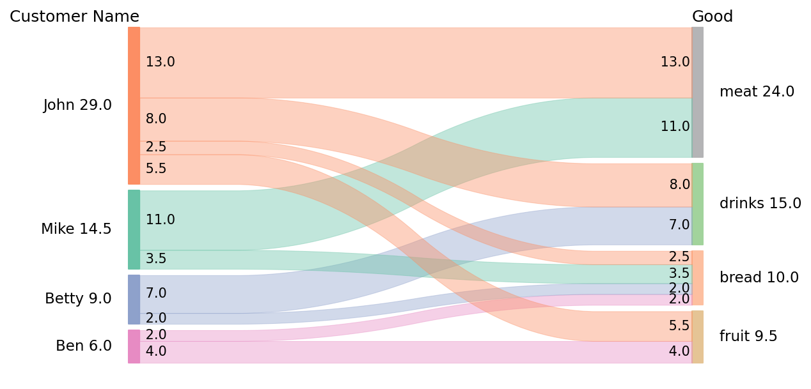

# pySankey

Uses matplotlib to create simple <a href="https://en.wikipedia.org/wiki/Sankey_diagram">
Sankey diagrams</a> flowing only from left to right.

[](https://badge.fury.io/py/pySankey)
[](https://travis-ci.org/anazalea/pySankey)
[](https://coveralls.io/github/anazalea/pySankey?branch=master)

## About this Fork

This repository is a **modified fork of [anazalea/pySankey](https://github.com/anazalea/pySankey)**.  
It is **not intended as a general-purpose package**, but rather as a tailored version created to support the replication of specific academic papers.  

The main differences from the original package are:
- Greater **formatting flexibility**  
- More options for **headers**  
- Expanded use of **colors**  

If you find these modifications useful, you are welcome to use this fork.  
For most users, however, the original [pySankey](https://github.com/anazalea/pySankey) package will be more appropriate and should be the first place to start.  

All credit for the original implementation goes to the upstream authors.  
This fork simply adapts the code to meet the replication requirements of some projects.

## How to Install and Use

To install this fork directly from GitHub (pinning to the replication-ready release):

```bash
pip install git+https://github.com/vasudeva-ram/pySankey@v0.1.0-replication#egg=pysankey
```

Once installed, you can import it in Python as usual:

```python
from pysankey import sankey
```

## Requirements

Requires python-tk (for python 2.7) or python3-tk (for python 3.x) you can
install the other requirements with:

``` bash
    pip install -r requirements.txt
```

## Example
Use the following dataset (CSV included as `customers-goods.csv`)
```
,customer,good,revenue
0,John,fruit,5.5
1,Mike,meat,11.0
2,Betty,drinks,7.0
3,Ben,fruit,4.0
4,Betty,bread,2.0
5,John,bread,2.5
6,John,drinks,8.0
7,Ben,bread,2.0
8,Mike,bread,3.5
9,John,meat,13.0
```

```python
import pandas as pd
from pySankey import sankey

df = pd.read_csv('customers-goods.csv', 
                 sep=',',
                 names=['id', 'customer', 'good', 'revenue'],
                 dtype={'revenue': 'float64'},
                 header=0
                )

df.drop(columns=['id'], inplace=True)

fig_properties = dict(
      colorDict={
           "John": "#FC8D62",
           "Mike": "#66C2A5",
           "Betty": "#8DA0CB",
           "Ben": "#E78AC3",
           "customer": "#A6D854",
           "good": "#FFD92F",
           "fruit": "#E5C494",
           "meat": "#B3B3B5",
           "drinks": "#A1D39B", 
           "bread": "#FDBF9F"
       },
    fontsize=10,
    rightColor=False, # indicates whether to use left colors for right side
    aspect=20,
    flowAlpha=0.4,
    pct_vals=False # indicates whether to format labels as percentages
)

sankey.sankey(left=df['customer'], 
      right=df['good'], 
      leftWeight=df['revenue'], 
      leftLabels=sankey.get_categories_by_cumulative_weight(df, 'customer', 'revenue'),
      rightLabels=sankey.get_categories_by_cumulative_weight(df, 'good', 'revenue'),
      figure_name="customer-good",
      leftStackTitle='Customer Name',
      rightStackTitle='Good',
      gcf_size={'w': 8.5, 'h':5},
      **fig_properties)
# Result is in "customer-good.png"
```



## Package development

### Lint

	pylint pysankey

### Coverage

	coverage run -m unittest
	coverage html
	# Open htmlcov/index.html in a navigator
